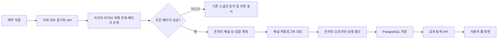

# 라이브 방송인 탐색기 개발 계획서

> 프로젝트 가칭: **LiveScope(라이브스코프)**<br>
> 대상 플랫폼: 치지직<br>
> 문서 성격: 계획서이자 개발 전 과정을 누적하는 마스터 문서<br>
> 최초 작성일: 2026-09-14<br>
> 상태: MVP 구현 완료 · 실제 API 인증/운영 DB/공개 서비스 배포 대기

> 2026-09-14 구현 기준: Next.js 16.3.5 + React 19.3 + TypeScript + Tailwind CSS 4 + Drizzle ORM + PostgreSQL로 구현했다. 최신 실제 상태와 검증 결과는 아래 작업 002 및 `docs/VALIDATION.md`를 기준으로 한다. 원본에 언급된 `LOL_META_ANALYZER_PLAN.md`는 이번 입력에 포함되지 않아 복원하거나 생성하지 않았다.

## 구현 상태 요약 — 2026-09-14

| 범위 | 상태 | 근거 |
|---|---|---|
| 데스크톱/모바일 탐색 UI, 8 LIVE + 8 OFFLINE 가상 샘플 | 완료 | `src/components`, `src/lib/demo-data.ts` |
| 검색, 상태/카테고리/세부 카테고리/태그, 정렬, 페이지네이션 | 완료 | 공개 API와 탐색 화면 |
| 즐겨찾기 로컬 저장, 이미지 대체, 접근성, 연령 제한 블러 | 완료 | 카드 컴포넌트와 E2E |
| 공식 API 클라이언트, 전체 페이지 순회, 오류/429 처리 | 완료 | 모킹 단위 테스트 |
| PostgreSQL 모델/마이그레이션, 상태 트랜잭션, 이력/숨김 보존 | 완료 | Drizzle + PGlite DB 통합 테스트 |
| 동기화 중복 잠금, 관리자 CLI, 보호된 내부 API | 완료 | 구현 및 로컬 검증, 운영 다중 프로세스 검증은 대기 |
| 실제 치지직 인증 및 운영 DB 수집 | 예정 | 인증키와 연결 정보 필요 |
| GitHub 코드/문서 업로드 | 완료 | `Candy0424/CHZZK-STREAM-EXPLORER-AI` main 브랜치 업로드 및 origin 추적 |
| 공개 웹 배포, 3회 실사용, 블로그/SNS 게시 | 예정 | 사용자 설정·실사용 이후 진행 |

저장소 표시 이름은 **CHZZK-STREAM-EXPLORER (AI)**, GitHub 식별자는 공백·괄호 제한에 따라 **CHZZK-STREAM-EXPLORER-AI**로 정했다. 초기 실제 채널 시드는 비어 있으며 사용자 선정 채널과 첫 공식 전체 라이브 수집으로 카탈로그를 구성한다. 미리보기의 가상 채널은 DB에 저장하지 않는다.

---

## 0. 주제 변경 기록

기존 주제였던 `롤 패치 기반 메타 분석기`에서 **치지직 온라인·오프라인 방송인 탐색기**로 프로젝트 주제를 변경한다.

- 기존 문서 `LOL_META_ANALYZER_PLAN.md`는 주제 변경 이력을 확인할 수 있도록 보관한다.
- 이 문서가 지금부터 프로젝트의 단일 기준 문서가 된다.
- 이후 설계, 구현, 테스트, 오류 수정, 배포, 실사용, 후기, 게시, GitHub 공개 과정은 모두 이 문서에 누적한다.

---

## 1. 문서 운영 원칙

- 모든 작업이 끝날 때마다 문서 마지막의 `개발 작업 일지`를 갱신한다.
- 기능과 구조를 바꾸면 관련 계획과 작업 일지를 함께 수정한다.
- API 응답 예시, 오류 원인, 해결 방법, 테스트 결과를 가능한 한 구체적으로 기록한다.
- Client Secret, 배포 토큰, 비밀번호 등 비밀값은 문서와 GitHub에 절대 기록하지 않는다.
- 구현 여부를 `예정`, `진행 중`, `완료`, `보류`로 구분한다.
- 제출 직전에는 계획과 실제 구현의 차이를 검토하고 최종 상태로 고친다.

작업 일지의 고정 형식은 다음과 같다.

```text
날짜 / 작업 번호:
상태:
목표:
수행한 작업:
변경한 파일:
사용한 명령·API:
문제와 원인:
해결 방법:
검증 방법과 결과:
결정 사항과 이유:
다음 작업:
```

---

## 2. 프로젝트 한 줄 정의

**치지직의 현재 방송 중인 스트리머를 한눈에 탐색하고, 방송 종료 시 오프라인으로 구분하며, 온라인 카드 클릭 시 해당 치지직 채널로 바로 이동할 수 있는 반응형 웹 서비스**를 만든다.

프로젝트 가칭은 `LiveScope`로 정한다. 치지직 개발자 문서상 애플리케이션 ID와 이름에 `chzzk`, `치지직`, `naver`, `네이버` 등의 공식 서비스명을 포함할 수 없으므로 최종 애플리케이션 이름도 독립적인 이름을 사용한다.

---

## 3. 핵심 사용자 경험

사용자는 사이트에 들어오자마자 현재 상태를 이해할 수 있어야 한다.

```text
사이트 접속
→ 현재 온라인·오프라인 방송인 수 확인
→ 온라인 우선 목록 탐색
→ 이름·카테고리·태그로 검색 또는 필터링
→ 방송 제목·시청자 수·시작 시간 확인
→ 온라인 방송인 카드 클릭
→ 새 탭에서 해당 치지직 채널 열기
```

### 온라인 카드

- 눈에 띄는 `LIVE` 배지
- 라이브 썸네일
- 채널명과 프로필 이미지
- 방송 제목
- 카테고리와 태그
- 현재 시청자 수
- 방송 시작 시각 또는 방송 경과 시간
- 카드 전체를 클릭할 수 있음
- 클릭 시 `https://chzzk.naver.com/{channelId}`를 새 탭에서 열음

### 오프라인 카드

- 채도가 낮은 프로필 이미지와 `OFFLINE` 배지
- 채널명과 마지막 확인 시각
- 마지막 방송 카테고리 또는 마지막 방송 제목
- 기본 정책에서는 클릭을 비활성화해 온라인 카드와 행동 차이를 명확히 함
- 향후 요구가 생기면 별도의 `채널 정보 보기` 버튼을 추가할 수 있음

### 상태 확인 지연 카드

- 마지막 완전 동기화 이후 API 오류가 발생했을 때 사용
- 기존 상태를 임의로 오프라인으로 바꾸지 않음
- `상태 확인 지연` 배지와 마지막 정상 확인 시각을 표시

---

## 4. 데이터 범위와 중요한 제약

치지직 Open API의 `라이브 목록 조회`는 **현재 진행 중인 방송 목록만** 반환한다. 모든 오프라인 채널을 한 번에 열거하는 API는 확인되지 않았다.

따라서 이 프로젝트에서 오프라인은 다음 범위로 정의한다.

> **이전에 라이브 목록에서 발견되었거나 프로젝트에 미리 등록한 채널이, 최신 전체 라이브 동기화 결과에 존재하지 않는 상태**

즉, 세상에 존재하는 모든 치지직 오프라인 채널을 보여주는 서비스가 아니라, 프로젝트가 관리하는 **탐색 대상 채널 카탈로그** 안에서 온라인·오프라인을 정확하게 구분하는 서비스다.

### MVP 카탈로그 정책

- 초기에는 직접 선정한 방송인 채널 ID 목록을 시드 데이터로 등록한다.
- 전체 라이브 동기화 중 새로 발견된 채널을 자동으로 카탈로그에 추가한다.
- 관리자가 숨김 처리한 채널은 사용자 목록에 노출하지 않는다.
- 삭제되거나 조회되지 않는 채널은 즉시 삭제하지 않고 `확인 필요` 상태로 둔다.
- 선정 기준과 등록 출처를 문서에 기록한다.

---

## 5. 핵심 기능 범위

### 5.1 라이브 대시보드

- 전체, 온라인, 오프라인, 상태 확인 지연 수 표시
- 마지막 정상 동기화 시각 표시
- 온라인 방송인을 목록 상단에 우선 배치
- 온라인/오프라인 탭 또는 상태 필터
- 데이터 갱신 버튼 제공 여부는 API 호출량을 검토한 뒤 결정

### 5.2 방송인 카드 목록

- 반응형 그리드: 데스크톱 4열, 태블릿 2~3열, 모바일 1열 기준
- 이미지 로딩 실패 시 기본 이미지 표시
- 온라인 썸네일 위에 LIVE 배지와 시청자 수 표시
- 오프라인 카드는 시각적으로 약하게 표현하되 텍스트 대비는 유지
- 카드 높이와 정보 위치를 통일해 탐색 속도를 높임

### 5.3 검색·필터·정렬

- 채널명과 방송 제목 검색
- 온라인/오프라인 상태 필터
- 게임, 스포츠, 기타 카테고리 필터
- 세부 카테고리와 태그 필터
- 정렬: 시청자 많은 순, 방송 시작 최신 순, 채널명 순
- 검색 결과가 없을 때 빈 상태 안내와 필터 초기화 버튼 제공

### 5.4 치지직 채널 이동

- 온라인 카드에만 명확한 클릭 상태와 키보드 포커스 제공
- 새 탭으로 열고 `noopener,noreferrer` 보안 옵션 적용
- URL은 API에서 받은 `channelId`로만 조립
- 외부 링크 아이콘과 `치지직에서 방송 보기` 접근성 이름 제공
- 잘못된 채널 ID나 이동 실패를 추적할 수 있도록 이벤트 로그 남김

### 5.5 갱신 상태 안내

- 마지막 성공 동기화 시각 표시
- 설정한 시간보다 오래된 데이터는 `정보가 지연되고 있습니다` 경고 표시
- 일부 페이지만 수집하고 실패한 경우 데이터 전체를 새 상태로 확정하지 않음
- 사용자가 새로고침해도 서버 캐시를 이용해 치지직 API를 매번 호출하지 않음

### 5.6 관리자용 최소 기능

MVP에서는 별도 관리자 화면 대신 시드 파일 또는 관리 스크립트를 사용한다.

- 채널 ID 추가·숨김
- 동기화 수동 실행
- 마지막 동기화 로그 확인
- 잘못된 채널 데이터 확인

관리자 웹 화면과 사용자 로그인은 후속 기능으로 둔다.

---

## 6. 치지직 Open API 사용 계획

### 6.1 사용할 공식 API

#### 라이브 목록 조회

```http
GET https://openapi.chzzk.naver.com/open/v1/lives?size=20&next={cursor}
Client-Id: 서버 환경 변수
Client-Secret: 서버 환경 변수
```

주요 응답 정보:

- `liveId`
- `liveTitle`
- `liveThumbnailImageUrl`
- `concurrentUserCount`
- `openDate`
- `adult`
- `tags`
- `categoryType`
- `liveCategory`, `liveCategoryValue`
- `channelId`, `channelName`, `channelImageUrl`
- `page.next`

라이브 목록은 시청자 수가 높은 순으로 반환되며 한 요청에서 최대 20개까지 조회된다. `page.next`가 없어질 때까지 순회해야 최신 전체 라이브 집합을 완성할 수 있다.

#### 채널 정보 조회

```http
GET https://openapi.chzzk.naver.com/open/v1/channels?channelIds={id1}&channelIds={id2}
Client-Id: 서버 환경 변수
Client-Secret: 서버 환경 변수
```

- 한 요청에서 채널 ID를 최대 20개까지 조회
- 채널명, 프로필 이미지, 팔로워 수, 인증 마크 갱신에 사용
- 일치하는 채널이 없으면 결과에서 제외되므로 요청 목록과 응답 목록을 비교해야 함

### 6.2 인증 방식

- 공개 라이브 탐색 기능은 사용자 로그인용 Access Token 없이 **Client 인증**으로 구현한다.
- `Client-Id`와 `Client-Secret`은 서버 환경 변수에만 저장한다.
- 브라우저에서 치지직 Open API를 직접 호출하지 않는다.
- `.env.example`에는 변수 이름만 적고 실제 값은 넣지 않는다.

### 6.3 API 오류 처리

- `400`: 파라미터와 커서 기록 후 해당 실행 실패 처리
- `401 INVALID_CLIENT`: 환경 변수와 애플리케이션 상태 점검
- `403 FORBIDDEN`: API 사용 권한과 애플리케이션 설정 점검
- `404 NOT_FOUND`: 채널 삭제로 단정하지 않고 확인 필요 상태로 처리
- `429 TOO_MANY_REQUESTS`: 즉시 반복 호출하지 않고 백오프 후 다음 주기로 넘김
- `500`: 제한 횟수만 재시도하고 기존 정상 스냅샷 유지

---

## 7. 온라인·오프라인 판정 알고리즘

잘못된 오프라인 표시를 막는 것이 이 프로젝트의 핵심 완성도 기준이다.

### 정상 동기화

1. 새로운 `sync_run`을 `RUNNING` 상태로 생성한다.
2. 첫 라이브 페이지를 요청한다.
3. 응답의 `page.next`로 다음 페이지를 계속 요청한다.
4. 각 페이지의 채널 ID를 임시 집합에 저장한다.
5. 마지막 페이지까지 성공했을 때만 `COMPLETE`로 표시한다.
6. 임시 집합에 포함된 채널은 `ONLINE`으로 갱신한다.
7. 카탈로그에는 있지만 집합에 없는 채널은 `OFFLINE`으로 갱신한다.
8. 새로 발견된 채널은 카탈로그에 추가한다.
9. 라이브 제목, 썸네일, 시청자 수, 시작 시각을 최신 값으로 교체한다.

### 중간 실패

1. 한 페이지라도 최종 실패하면 `sync_run`을 `FAILED`로 표시한다.
2. 지금까지 모은 부분 집합으로 오프라인 상태를 확정하지 않는다.
3. 기존 온라인·오프라인 상태와 마지막 성공 시각을 유지한다.
4. 화면에 `상태 확인 지연` 안내를 표시한다.

### 상태 노후화 기준 초안

- 0~5분: 최신
- 5~15분: 지연 가능성 표시
- 15분 초과: 상태 확인 지연 강조

운영 환경의 실제 갱신 주기와 API Quota를 확인한 뒤 기준을 조정한다.

---

## 8. 데이터 동기화 구조



### 갱신 주기 초안

- 개발 환경: 필요할 때 수동 실행
- 배포 환경: 우선 5분 간격
- API Quota와 전체 페이지 수를 측정한 뒤 2~10분 사이에서 조정
- 사용자 요청 수와 무관하게 서버가 한 번만 수집한 결과를 공유

실시간처럼 보이게 하기 위해 호출 주기를 지나치게 줄이지 않는다. 화면에는 반드시 마지막 갱신 시각을 표시한다.

---

## 9. 기술 구조

이 프로젝트는 별도 분석 서버가 필요하지 않으므로 한 저장소의 Next.js 풀스택 구조로 단순화한다.

| 영역 | 기술 | 선정 이유 |
|---|---|---|
| 웹·서버 | Next.js + TypeScript | UI와 서버 API를 한 프로젝트에서 관리 가능 |
| 스타일 | Tailwind CSS | 카드 그리드와 반응형 상태 UI 구현이 빠름 |
| 데이터 접근 | Prisma 또는 Drizzle ORM | 채널·라이브·동기화 관계와 마이그레이션 관리 |
| 데이터베이스 | PostgreSQL | 배포 환경에서 안정적인 영속 상태 저장 |
| 검증 | Zod | 외부 API 응답과 쿼리 파라미터 런타임 검증 |
| 테스트 | Vitest + Playwright | 상태 판정 로직과 실제 카드 클릭 흐름 검증 |
| 배포 | Next.js 지원 호스팅 + 관리형 PostgreSQL | 공개 URL과 서버 환경 변수 구성이 단순함 |
| 예약 작업 | 호스팅 Cron 또는 GitHub Actions | 정해진 간격으로 서버 동기화 실행 |

배포 서비스와 ORM은 구현 시점의 제한을 확인한 뒤 하나로 확정한다.

### 예상 저장소 구조

```text
livescope/
├─ src/
│  ├─ app/
│  │  ├─ page.tsx                 # 방송인 탐색 화면
│  │  ├─ api/streamers/route.ts   # 공개 조회 API
│  │  └─ api/internal/sync/       # 인증된 동기화 API
│  ├─ components/
│  │  ├─ streamer-card.tsx
│  │  ├─ status-filter.tsx
│  │  ├─ search-bar.tsx
│  │  └─ sync-status.tsx
│  ├─ lib/
│  │  ├─ chzzk-client.ts          # 공식 API 호출 모듈
│  │  ├─ sync-lives.ts            # 완전 동기화 로직
│  │  ├─ database.ts
│  │  └─ env.ts
│  └─ types/
├─ prisma/ 또는 drizzle/
├─ scripts/
│  └─ seed-channels.ts
├─ tests/
├─ docs/
├─ .env.example
├─ README.md
└─ CHZZK_STREAM_EXPLORER_PLAN.md
```

---

## 10. 데이터 모델

### `channels`

- `channel_id`: 치지직 채널 식별자, 기본 키
- `channel_name`
- `channel_image_url`
- `follower_count`
- `verified_mark`
- `status`: `ONLINE`, `OFFLINE`, `UNKNOWN`
- `is_visible`
- `first_discovered_at`
- `last_seen_live_at`
- `last_checked_at`
- `updated_at`

### `current_lives`

- `live_id`
- `channel_id`
- `live_title`
- `thumbnail_url`
- `concurrent_user_count`
- `open_date`
- `adult`
- `category_type`
- `category_id`
- `category_name`
- `tags`
- `sync_run_id`

온라인 상태인 채널만 존재한다. 방송이 종료된 채널의 행은 삭제하되 마지막 방송 정보는 별도 기록에 보존한다.

### `live_history`

- `live_id`
- `channel_id`
- `last_title`
- `last_category_name`
- `started_at`
- `last_seen_at`

오프라인 카드의 마지막 방송 정보와 실사용 분석에 활용한다.

### `sync_runs`

- `id`
- `status`: `RUNNING`, `COMPLETE`, `FAILED`
- `started_at`, `completed_at`
- `page_count`
- `live_count`
- `new_channel_count`
- `error_code`, `error_message`

---

## 11. 공개 API 설계 초안

### 방송인 목록

```http
GET /api/streamers?status=online&query=게임&category=GAME&sort=viewers_desc&page=1
```

응답에는 다음을 포함한다.

- 필터된 방송인 목록
- 전체 결과 수
- 상태별 개수
- 마지막 정상 동기화 시각
- 데이터 지연 여부
- 다음 페이지 정보

### 내부 동기화

```http
POST /api/internal/sync
Authorization: Bearer {CRON_SECRET}
```

- 브라우저에서 직접 실행할 수 없게 보호한다.
- 동일 시간대 중복 실행을 잠금으로 막는다.
- 응답에 비밀정보나 원본 인증 헤더를 포함하지 않는다.

---

## 12. 디자인 방향

### 시각 콘셉트

- 어두운 중립 배경 위에 밝은 초록색을 LIVE 포인트 컬러로 사용
- 공식 치지직 화면을 복제하지 않고 독자적인 카드·타이포그래피 구성 사용
- 온라인과 오프라인을 색만으로 구분하지 않고 텍스트 배지와 아이콘 병행
- 온라인 썸네일을 중심으로 하되 방송 제목의 가독성을 우선
- 부드러운 카드 호버와 키보드 포커스 표시

### 데스크톱 와이어프레임 초안

```text
┌─────────────────────────────────────────────────────────────┐
│ LiveScope                    검색창          마지막 갱신 1분 전 │
├─────────────────────────────────────────────────────────────┤
│ 전체 124     LIVE 38     OFFLINE 84     확인 지연 2          │
│ [전체] [온라인] [오프라인]  [카테고리 ▼] [시청자순 ▼]         │
├─────────────────────────────────────────────────────────────┤
│ ┌────────────┐ ┌────────────┐ ┌────────────┐ ┌────────────┐ │
│ │ LIVE 1,230 │ │ LIVE   820 │ │ OFFLINE    │ │ OFFLINE    │ │
│ │  썸네일    │ │  썸네일    │ │ 프로필     │ │ 프로필     │ │
│ │ 채널/제목  │ │ 채널/제목  │ │ 채널/최근  │ │ 채널/최근  │ │
│ └────────────┘ └────────────┘ └────────────┘ └────────────┘ │
└─────────────────────────────────────────────────────────────┘
```

### 접근성

- 카드 링크를 키보드로 탐색 가능하게 구현
- 썸네일과 프로필 이미지에 적절한 대체 텍스트 제공
- 긴 방송 제목을 시각적으로 줄여도 접근성 이름에는 전체 제목 제공
- LIVE/OFFLINE을 색상만으로 전달하지 않음
- 외부 사이트가 새 탭에서 열린다는 사실을 안내
- 로딩 스켈레톤과 모션 감소 설정 지원

---

## 13. 성인 방송과 콘텐츠 안전 처리

Open API의 `adult` 값을 사용해 연령 제한 방송을 구분한다.

- 기본 목록에서는 연령 제한 썸네일을 블러 처리한다.
- 카드에 `연령 제한` 라벨을 표시한다.
- 사용자가 명시적으로 보기 전까지 제목 외 민감할 수 있는 시각 정보를 강조하지 않는다.
- 서비스가 콘텐츠를 재생하는 것이 아니라 공식 채널로 이동시키는 탐색기임을 명확히 한다.
- API가 제공하지 않는 기준으로 임의 판정하지 않는다.

---

## 14. 단계별 개발 일정

약 7~10일의 MVP 일정을 기준으로 한다.

### 1단계 — 범위·디자인 확정 (1일)

- 프로젝트 이름과 초기 채널 카탈로그 확정
- 홈 화면 와이어프레임 제작
- 데이터 모델과 온라인·오프라인 판정 규칙 확정
- 완료 기준: 화면과 상태 전환 규칙을 문서만 읽고 이해할 수 있음

### 2단계 — UI 프로토타입 (1일)

- Next.js 프로젝트 구성
- 샘플 데이터로 온라인·오프라인 카드 구현
- 검색·상태 필터·정렬 구현
- 모바일 반응형 적용
- 완료 기준: 실제 API 없이 전체 사용자 흐름을 시연 가능

### 3단계 — 공식 API 클라이언트 (1일)

- 환경 변수 검증
- 라이브 목록 커서 페이지네이션 구현
- 채널 정보 20개 단위 배치 조회 구현
- 오류 분류, 재시도, 백오프 구현
- 완료 기준: 개발 환경에서 비밀키 노출 없이 실제 응답 수집 가능

### 4단계 — 데이터베이스와 상태 동기화 (1~2일)

- 채널, 라이브, 이력, 동기화 실행 테이블 생성
- 완전 동기화가 성공했을 때만 상태를 확정하는 트랜잭션 구현
- 중복 실행 잠금과 실패 복구 구현
- 완료 기준: API 중간 실패 테스트에서 잘못된 오프라인 전환이 발생하지 않음

### 5단계 — 실제 데이터 UI 연결 (1일)

- 공개 목록 API와 화면 연결
- 갱신 시각과 지연 경고 표시
- 온라인 카드 외부 링크 구현
- 이미지 실패, 빈 결과, 로딩, 오류 상태 마무리
- 완료 기준: 온라인 카드를 눌렀을 때 정확한 공식 채널이 새 탭에서 열림

### 6단계 — 테스트와 배포 (1~2일)

- 단위·통합·E2E 테스트
- Client Secret 노출 검사
- 데이터베이스 마이그레이션과 예약 작업 배포
- PC·모바일·다른 브라우저에서 확인
- 완료 기준: 공개 URL에서 일정 시간 동안 상태 갱신과 링크 이동이 정상 작동

### 7단계 — 실사용·후기·게시·GitHub 정리 (1일 이상)

- 서로 다른 시간대에 최소 3회 사용
- 실제 치지직 상태와 탐색기 상태 비교
- 장단점과 개선점 작성
- 블로그/SNS 게시 및 GitHub 공개
- 완료 기준: 평가 6개 항목의 증거 링크가 README와 본 문서에 모두 존재

---

## 15. 테스트 계획

### 단위 테스트

- `page.next`가 있을 때 마지막 페이지까지 호출하는지
- 중복 채널 ID를 한 번만 저장하는지
- 전체 동기화 성공 시 온라인·오프라인이 올바르게 바뀌는지
- 중간 페이지 실패 시 기존 상태가 유지되는지
- 성인 방송 블러 상태가 올바르게 계산되는지
- 검색, 필터, 정렬 결과가 기대값과 일치하는지
- 채널 URL에 예상하지 않은 문자열이 들어가지 않는지

### 통합 테스트

- 공식 API 응답 모킹을 사용한 정상·401·429·500 시나리오
- 데이터베이스 트랜잭션 중 실패와 롤백
- 같은 시각에 두 동기화 요청이 들어오는 경우
- 채널 정보 조회에서 일부 ID가 누락되는 경우

### E2E 테스트

1. 메인 화면에 온라인 카드와 오프라인 카드가 보인다.
2. 온라인 필터 선택 시 온라인 카드만 보인다.
3. 채널명 검색으로 원하는 방송인을 찾는다.
4. 온라인 카드 클릭 시 올바른 치지직 URL이 새 탭으로 열린다.
5. 오프라인 카드는 링크처럼 동작하지 않는다.
6. 오래된 데이터에서는 지연 경고가 보인다.

### 수동 검증

- 실제 치지직 사이트와 최소 20개 채널 상태 비교
- 방송 시작·종료 전후 상태 반영 시간 측정
- Chrome과 Edge 확인
- 360px 모바일 화면과 데스크톱 확인
- 이미지가 없는 채널과 매우 긴 제목 확인
- 시청자 수 0, 999, 1,000 이상 표기 확인
- 연령 제한 방송 표시 확인

---

## 16. 완성도와 배포 체크리스트

- 공개 URL이 HTTPS로 열림
- 첫 화면, 검색, 필터, 정렬, 새로고침이 정상 작동
- 온라인 카드가 실제 채널 ID와 일치하는 링크를 생성
- Client Secret이 HTML, JavaScript 번들, 네트워크 응답, Git 기록에 없음
- 예약 동기화가 설정 주기대로 작동
- 401, 429, 500 발생 시 화면 전체가 깨지지 않음
- 불완전한 동기화로 온라인 방송인이 오프라인 처리되지 않음
- 마지막 성공 동기화 시각과 지연 상태가 표시됨
- 모바일에서 카드와 필터가 화면을 벗어나지 않음
- 콘솔 오류와 접근성 치명 오류가 없음
- README의 설치 과정을 깨끗한 환경에서 재현
- `.env.example`, 라이선스, 출처, 스크린샷, 데모 URL 준비

---

## 17. 평가 6개 항목 달성 전략 — 총 24점 목표

| 평가 항목 | 구현·문서 산출물 | 완료 증거 |
|---|---|---|
| 1. 주제 선정·구현 | 온라인·오프라인 상태 탐색, 검색·필터, 온라인 채널 이동 | 공개 데모와 핵심 기능 영상 |
| 2. 높은 완성도 | 완전 동기화, 오류 복구, 반응형 UI, 자동 테스트, 정상 배포 | 테스트 결과, 배포 체크리스트, 디버깅 기록 |
| 3. 개발·사용법 문서 | 본 마스터 문서, README, API·DB 설명, 설치법, 트러블슈팅 | GitHub 문서와 누적 작업 일지 |
| 4. 직접 사용·후기 | 서로 다른 시간대에 실제 상태 비교, 장단점·개선점 기록 | 3회 이상 실사용 기록과 캡처 |
| 5. 블로그·SNS 게시 | 문제, API 제약, 상태 판정, 구현, 결과, 회고 글 | 공개 게시물 URL |
| 6. GitHub 정리·업로드 | 코드, 문서, 테스트, 예제 환경 변수, 데모 링크 | 공개 GitHub 저장소 URL |

### 감점 방지 포인트

- 샘플 데이터만 보이는 화면이 아니라 실제 공식 API 데이터가 갱신되어야 한다.
- 온라인·오프라인 기준과 데이터 갱신 시각을 사용자에게 숨기지 않는다.
- API Secret을 프론트엔드에 넣지 않는다.
- 오프라인 전체 채널을 제공한다고 과장하지 않고 카탈로그 범위를 설명한다.
- API 장애를 오프라인으로 오판하지 않는다.
- 카드 클릭 링크가 다른 채널로 연결되는지 반드시 자동·수동 검증한다.

---

## 18. README 및 사용자 사용법 구성

최종 README에 아래 항목을 포함한다.

1. 프로젝트 소개와 실행 화면
2. 핵심 기능
3. 온라인·오프라인 판정 기준
4. 데이터 출처와 API 제약
5. 기술 스택과 구조도
6. 사전 준비: 치지직 개발자 센터 애플리케이션
7. 환경 변수 설정
8. 데이터베이스 설치·마이그레이션
9. 로컬 실행법
10. 채널 시드 데이터 추가 방법
11. 동기화 수동 실행법
12. 테스트 실행법
13. 배포와 예약 작업 설정
14. 트러블슈팅
15. 실사용 후기
16. 한계와 후속 기능
17. 데모·블로그·GitHub 링크

### 환경 변수 예시

```dotenv
CHZZK_CLIENT_ID=
CHZZK_CLIENT_SECRET=
DATABASE_URL=
CRON_SECRET=
```

### 필수 트러블슈팅 항목

- `401 INVALID_CLIENT`: ID·Secret·환경 변수 로딩 확인
- `403 FORBIDDEN`: 애플리케이션 API 권한 확인
- `429 TOO_MANY_REQUESTS`: 동기화 주기와 페이지 수 조정
- 이미지가 보이지 않음: 원격 이미지 도메인 및 기본 이미지 처리 확인
- 방송 종료가 반영되지 않음: 마지막 완전 동기화 성공 여부 확인
- 온라인 방송이 오프라인으로 보임: 커서 전체 순회와 카탈로그 상태 확인
- 예약 작업이 실행되지 않음: Cron 인증 헤더와 배포 로그 확인
- 로컬 DB와 배포 DB 스키마 불일치: 마이그레이션 상태 확인

---

## 19. 실사용 후기 계획

최소 오전·오후·야간 등 서로 다른 시간대에 3회 사용한다.

### 사용 시나리오

1. 사이트에서 현재 온라인 방송인 수를 확인한다.
2. 관심 카테고리로 필터링한다.
3. 방송 제목과 시청자 수를 비교한다.
4. 온라인 카드로 실제 치지직 채널을 연다.
5. 실제 사이트의 방송 상태와 탐색기 상태를 비교한다.
6. 방송 종료 뒤 오프라인 전환에 걸린 시간을 기록한다.

### 후기 양식

```text
사용 날짜와 시간:
마지막 동기화 시각:
확인한 채널 수:
온라인 일치 수 / 불일치 수:
오프라인 일치 수 / 불일치 수:
채널 이동 성공 여부:
검색·필터 사용 상황:
좋았던 점:
불편했던 점:
상태가 늦거나 잘못 표시된 사례:
원인 분석:
가장 먼저 개선할 기능:
```

후기에서는 단순히 “사용하기 편했다”로 끝내지 않고 정확도, 상태 반영 시간, 탐색 시간, 모바일 사용성을 기록한다.

---

## 20. 블로그·SNS 게시 계획

### 글 제목 예시

> API 장애를 오프라인으로 착각하지 않는 라이브 방송인 탐색기 만들기

### 글 구성

1. 프로젝트를 선택한 이유
2. 사용자가 겪는 탐색 문제
3. 핵심 화면과 사용 흐름
4. 치지직 Open API의 라이브 목록과 채널 정보
5. 오프라인 채널 전체 목록이 없다는 제약
6. 완전 동기화 후에만 상태를 확정한 설계
7. Client Secret 보호와 서버 캐시
8. 검색·필터·반응형 UI 구현
9. 401·429·부분 실패 디버깅
10. 배포와 예약 작업
11. 직접 사용 결과와 개선점
12. 데모와 GitHub 링크

준비할 이미지:

- 온라인·오프라인이 함께 보이는 메인 화면
- 검색과 카테고리 필터
- 모바일 화면
- 상태 확인 지연 안내
- 온라인 카드에서 치지직 채널로 이동하는 장면
- 테스트 결과 또는 동기화 로그

---

## 21. 위험 요소와 대응

| 위험 | 영향 | 대응 |
|---|---|---|
| 라이브 목록이 페이지당 최대 20개 | 전체 순회 호출량 증가 | 서버 단일 예약 작업, 캐시, 측정 후 갱신 주기 조정 |
| 일부 페이지 수집 실패 | 온라인 방송을 오프라인으로 오판 | 전체 순회 성공 시에만 상태 트랜잭션 커밋 |
| API Quota 초과 | 갱신 지연 | 429 백오프, 호출량 로그, 주기 완화 |
| Client Secret 노출 | 애플리케이션 보안 사고 | 서버 전용 환경 변수, 응답·로그 마스킹, Git 검사 |
| 모든 오프라인 채널을 조회할 수 없음 | 서비스 범위 오해 | 관리 카탈로그 기준임을 UI와 문서에 명시 |
| 썸네일·이미지 URL 만료 또는 실패 | 카드 레이아웃 손상 | 기본 이미지와 오류 처리 |
| 연령 제한 방송 썸네일 | 부적절한 노출 | `adult` 기준 기본 블러와 라벨 |
| API 응답 형식 변경 | 동기화 실패 | Zod 검증, 원인 로그, 기존 스냅샷 유지 |
| 외부 링크 조립 오류 | 잘못된 채널 이동 | channelId 검증과 E2E 테스트 |
| 공식 서비스와 혼동되는 이름·디자인 | 애플리케이션 등록 문제 | 공식 명칭 없는 독립 이름과 독자 디자인 사용 |

---

## 22. 후속 확장 기능

MVP 완성 후 다음 순서로 검토한다.

1. 사용자가 브라우저에 관심 채널을 저장하는 즐겨찾기
2. 즐겨찾기 방송 시작 알림
3. 최근 방송 시작·종료 기록
4. 카테고리별 온라인 추이 차트
5. 사용자 로그인과 기기 간 즐겨찾기 동기화
6. 온라인 전환만 갱신하는 실시간 이벤트 지원 여부 조사
7. 관리자용 채널 카탈로그 화면
8. PWA 설치와 모바일 홈 화면 지원

알림과 사용자 로그인은 개인정보와 권한 범위를 넓히므로 별도 단계로 둔다.

---

## 23. 공식 자료 및 정책 확인

개발 시작 전과 배포 직전에 공식 문서를 다시 확인한다.

- [치지직 Developers 개요](https://chzzk.gitbook.io/chzzk)
- [라이브 목록 API](https://chzzk.gitbook.io/chzzk/chzzk-api/live)
- [채널 정보 API](https://chzzk.gitbook.io/chzzk/chzzk-api/channel)
- [Client 인증 및 공통 오류](https://chzzk.gitbook.io/chzzk/chzzk-api/tips)
- [치지직 개발자 센터](https://developers.chzzk.naver.com/)

확인된 주요 사항:

- 라이브 목록 조회와 타 채널 정보 조회는 애플리케이션 등록 후 Client 인증이 필요하다.
- Client 인증 헤더에는 `Client-Id`, `Client-Secret`이 들어간다.
- 라이브 목록은 페이지당 최대 20개이며 `page.next`로 다음 목록을 요청한다.
- 채널 정보는 한 요청에서 최대 20개 채널 ID를 조회한다.
- API는 `429 TOO_MANY_REQUESTS`를 반환할 수 있다.
- 애플리케이션 이름에 공식 서비스명과 제한 단어를 포함하지 않는다.

---

## 24. 바로 다음 작업

계획 승인 후 아래 순서로 진행한다.

1. `LiveScope` 가칭 유지 여부와 초기 카탈로그 기준 결정
2. 데스크톱·모바일 와이어프레임 작성
3. 온라인 8개·오프라인 8개 샘플 데이터로 UI 프로토타입 제작
4. 치지직 개발자 센터 애플리케이션 등록과 Client 인증값 준비
5. 실제 라이브 목록 1회 전체 순회 실험
6. 전체 페이지 수, 요청 시간, Quota 반응을 측정해 갱신 주기 확정
7. PostgreSQL 스키마와 상태 동기화 로직 구현

---

## 25. 개발 작업 일지

### 2026-09-14 / 작업 001 — 프로젝트 주제 변경 및 재기획

- **상태:** 완료
- **목표:** 기존 롤 메타 분석기 주제를 치지직 온라인·오프라인 방송인 탐색기로 변경
- **수행한 작업:** 공식 Open API 조사, 기능 범위, 데이터 제약, 상태 판정, 기술 구조, 일정, 테스트, 실사용, 게시, GitHub 전략 재작성
- **변경한 파일:** `CHZZK_STREAM_EXPLORER_PLAN.md` 신규 생성, `LOL_META_ANALYZER_PLAN.md`를 보관 상태로 변경
- **사용한 명령·API:** 작업 공간 확인, 치지직 Developers의 Live·Channel·Authorization·Tips 문서 조사
- **문제와 원인:** 라이브 목록 API는 현재 방송만 반환하여 모든 오프라인 채널을 직접 열거할 수 없음
- **해결 방법:** 이전 발견 채널과 초기 시드 채널로 카탈로그를 만들고, 전체 라이브 페이지 순회가 완전히 성공했을 때만 부재 채널을 오프라인으로 판정
- **검증 방법과 결과:** 공식 문서에서 라이브 전체 목록, 커서 페이지네이션, 채널 ID, Client 인증, 채널 정보 조회 필드를 확인
- **결정 사항과 이유:** 사용자 로그인은 MVP에서 제외하고 Client 인증을 서버에서만 사용해 구현 범위와 보안 위험을 줄임
- **다음 작업:** 와이어프레임과 샘플 데이터 기반 UI 프로토타입 제작

### 2026-09-14 / 작업 002 — LiveScope MVP 구현과 GitHub 저장소 연결

- **상태:** 구현 완료, 최종 검증·GitHub 업로드 진행 중
- **목표:** 기획서 기준의 탐색 웹앱, 공식 API/DB 동기화 구조, 테스트·문서를 한 저장소에 구현
- **수행한 작업:** Next.js 프로젝트 생성, 독자적 다크 UI와 자체 SVG 샘플 8개, 상태 집계·검색·정렬·세부 필터·즐겨찾기, 오프라인 비활성화, 연령 제한 블러, 지연 안내, 공개 목록 API, Bearer 보호 동기화 API, 20개 단위 채널 조회, 전체 라이브 순회, 오류 재시도와 429 쿨다운, 세션 advisory lock, PostgreSQL 트랜잭션과 방송 이력, 관리자 CLI, CI와 선택 활성화 예약 작업, README/운영/검증/실사용/블로그 초안 작성
- **변경한 파일:** `src/`, `scripts/`, `tests/`, `drizzle/`, `.github/workflows/`, `data/`, `public/art/`, `docs/`, `README.md`, `.env.example`, `LICENSE`, 프로젝트 설정 및 본 문서
- **사용한 명령·API:** `npm install`, `drizzle-kit generate`, `tsc --noEmit`, `eslint`, `vitest`, `playwright test`, `next build`, `git init -b main`, `git remote add origin`, 공식 Live/Channel/Client 인증 문서 재확인, GitHub 저장소 생성 UI
- **문제와 원인:** 로컬 Node 20.15는 Next.js 실행 요구보다 낮음. `C#` 경로를 Vite/일부 CSS import 도구가 URL fragment로 처리함. API 배치 테스트의 Response 객체 재사용으로 두 번째 body 읽기가 실패함. 실제 인증키/운영 DB는 제공되지 않음
- **해결 방법:** 사용 가능한 Node 24 런타임으로 구현·검증, npm test에 동일 소스 임시 디렉터리 및 symlink 보존 실행기를 추가, Tailwind utilities/theme 직접 지시문 사용, 모킹 응답을 요청마다 새로 생성, 화면에 명시적인 미리보기 모드를 제공하고 실모드 연결 방법을 문서화
- **검증 방법과 결과:** 타입 검사/린트/운영 빌드 및 초기 E2E 14개 통과. 운영 의존성 감사 0건, 브라우저 정적 번들에 서버 비밀 환경 변수 이름 없음. 최신 전체 실행 결과는 작업 003에 기록
- **결정 사항과 이유:** Drizzle ORM을 선택해 명시적 PostgreSQL 트랜잭션 사용. 세션 잠금 유지가 필요한 동기화에는 직접/세션 DB 연결 사용. 5분 예약 작업은 Secrets와 활성화 변수 설정 전 실행하지 않음. 샘플 링크는 허구의 공식 채널을 열지 않고 안내를 표시함. 실제 연령 확인은 치지직에서 수행
- **다음 작업:** 최종 검증과 GitHub push. 이후 실제 인증키/DB 설정, 첫 전체 수집, 호스팅 배포와 시간대별 실사용

### 2026-09-14 / 작업 003 — 최종 검증 및 GitHub 공개 업로드

- **상태:** 완료
- **목표:** 구현 결과를 검증하고 요청한 GitHub 저장소에 코드와 기획서를 업로드
- **수행한 작업:** Windows 특수문자 경로 문제 수정 후 전체 테스트 재실행, 데스크톱/모바일 실행 화면 저장, 소스 포맷 정리, `.env` 제외 및 브라우저 번들 검사, Git main 커밋과 원격 push, GitHub에서 파일/README/실행 화면 링크 확인
- **변경한 파일:** `docs/VALIDATION.md`, `docs/screenshots/desktop.png`, `docs/screenshots/mobile.png`, `README.md`, `.gitattributes`, 테스트 및 본 개발 일지
- **사용한 명령·API:** `npm test`, `tsc --noEmit`, `eslint .`, `next build`, `playwright test`, `npm audit --omit=dev`, `git diff --cached --check`, `git commit`, `git push --set-upstream origin main`
- **문제와 원인:** GitHub 저장소 이름에 공백과 괄호를 사용할 수 없음. 원래 Node 런타임과 일부 도구의 Windows `#` 경로 호환성 문제
- **해결 방법:** 식별자를 `CHZZK-STREAM-EXPLORER-AI`로 정하고 표시 이름을 설명/README에 보존. Node 24 및 테스트 진입점 보완 사용. 현재 프로젝트 폴더를 원격 저장소 origin으로 연결
- **검증 방법과 결과:** 단위/DB 통합 테스트 **31/31 통과**, 데스크톱/360px 모바일 E2E **14/14 통과**, 타입 검사·린트·운영 빌드 성공. 화면 촬영 과정의 탐색 테스트 2개도 성공. 운영 의존성 취약점 0개, 개발 도구 moderate 4개는 검증 문서에 기록. GitHub에서 최초 소스 커밋 `c8af0ea`의 업로드를 확인
- **결정 사항과 이유:** 실제 인증키/운영 DB가 없어 공식 API 실수집·웹 배포·실사용 후기는 완료로 표시하지 않음. 현재 앱은 명시적인 샘플 모드로 실행. GitHub Actions CI는 push 후 시작되며 로컬 검증과 구분
- **다음 작업:** `.env.local` 또는 운영 Secrets 설정 후 실제 라이브 전체 수집, DB 세션 잠금 운영 검증, 배포 URL 발급, 실제 채널 20개 비교, 시간대별 3회 후기와 게시물 완성
- **결과 링크:** https://github.com/Candy0424/CHZZK-STREAM-EXPLORER-AI

### 2026-09-14~15 / 작업 004 — 실제 방송 연결 및 전체 목록 오류 수정

- **상태:** 실제 API/로컬 DB 연결과 화면 검증 완료
- **목표:** 샘플만 보이던 환경을 실제 치지직 방송 탐색 환경으로 전환
- **수행한 작업:** 승인받은 LiveScope 앱 등록과 인증키 로컬 저장, PostgreSQL 17.11 및 앱 전용 계정 구성, 첫 전체 라이브 수집, 5분 간격 수집 프로세스와 Windows 실행 파일 추가
- **문제와 원인:** API 키와 DB 미설정 외에도 실제 API의 null/신규 카테고리를 엄격한 열거형이 거부함. 5천 개 규모 스냅샷이 Next.js Data Cache의 2 MB 한도를 넘어 빈 목록 캐시가 계속 반환됨
- **해결 방법:** 카테고리 ID/이름을 보존하고 미지정/신규 종류를 기타로 분류. 전체 스냅샷을 30초 프로세스 메모리에 보관하며 동시 요청 공유, 명시적 무효화, 실패 후 재시도 지원. 다른 프로젝트가 쓰는 3000 대신 실제 실행 기본 포트를 3001로 지정
- **검증 방법과 결과:** 첫 수집 260페이지/5,169개/30.331초 COMPLETE. 실제 PostgreSQL 독립 세션 잠금 및 비슈퍼유저 앱 계정 확인. 후속 자동 수집과 온라인/오프라인 전환 확인. 회귀 테스트 39개, 운영 빌드와 타입 검사 통과. 실제 썸네일/제목/시청자 수/외부 링크 표시 및 방송인 이름 검색 확인
- **변경한 파일:** API 응답 검증, 스냅샷 캐시와 동기화 API, 실행 스크립트, 캐시·클라이언트 테스트, README/구조/검증 문서. 인증키/DB/실행 바이너리는 Git 제외
- **실행 방법:** `start-livescope.cmd` 또는 `npm run dev:live`, `http://127.0.0.1:3001`
- **다음 작업:** 외부 호스팅과 운영 DB 배포, 실제 채널 비교와 상태 반영 지연 측정, 시간대별 실사용 기록

### 2026-09-15 / 작업 005 — 선택 가능한 화면 테마

- **상태:** 구현·검증 완료
- **목표:** 고정된 초록색 다크 화면을 사용자가 원하는 분위기로 바꿀 수 있도록 개선
- **수행한 작업:** 상단 테마 선택창과 5개 미리보기 추가. 클라우드(새 기본값), 미드나잇, 라벤더, 샌드, 포레스트 제공. 화면 전체 색상을 공통 변수로 전환
- **저장·접근성:** 선택한 테마를 브라우저에 저장하고 첫 화면부터 복원. 다른 탭과 동기화. 저장 차단 시에도 즉시 적용하고 안내 표시. 키보드 선택·Escape 닫기·초점 복귀, 모바일 화면 범위 지원
- **문제와 해결:** 밝은/어두운 전환에서 버튼 글자와 배경의 색상 애니메이션 때문에 잠깐 대비가 낮아져 함께 즉시 전환하도록 수정. 테스트 포트 분리 및 worker 2개로 로컬 검사 충돌·과부하 방지
- **검증 방법과 결과:** 기존 탐색 E2E 14개, 최종 테마 E2E 6개 통과. 5개 팔레트의 본문·보조 글자·기본 버튼 대비 4.5:1 이상, 새로고침 복원, React 로딩 전 적용과 다중 탭 동기화 확인. 타입 검사·린트·운영 빌드 성공
- **변경한 파일:** 테마 정의·선택 컴포넌트·전역 스타일·루트 레이아웃, 테마 E2E와 Playwright 설정, README·검증 문서·화면 이미지

### 2026-09-15 / 작업 006 — MCP 도구 서버와 제출 증거 보완

- **상태:** 서버 구현 및 실제 MCP 호출 검증 완료
- **목표:** 결과보고서의 도구 등록·실행 근거와 실사용 기록 보완
- **수행한 작업:** 공식 TypeScript MCP SDK 2.0.0을 사용해 검색·채널 상태·현황 조회 도구 등록. stdio 실행 진입점, 검증 클라이언트, 연결 안내 추가. 모든 도구는 동일 DB 스냅샷을 읽고 입력 스키마·신선도·샘플 구분·안전한 오류 응답 적용
- **검증 결과:** MCP 프로토콜 테스트 8개를 포함한 총 47개 테스트, 타입 검사·ESLint·운영 빌드 통과. 09:27 KST 실제 DB 기반 목록 조회 및 세 도구 호출 성공(카탈로그 6,154 / 온라인 827 / 오프라인 5,327), 비정상 페이지 크기 거부
- **실사용 기록:** 사용자 피드백에 따른 실제 데이터 연결·테마 개선을 기록하고, 오전 실제 검색·즐겨찾기 동작을 확인. 시간대별 장기 측정은 후속 검증으로 구분
- **구현 경계:** 도구 선택은 연결한 AI 호스트가 담당하며 서버는 등록 이름과 검증된 인자로 조회 함수를 실행. LLM의 자연어 추론 자체를 검증했다고 기록하지 않음
- **외부 게시:** 벨로그 전체 공개 게시 완료. https://velog.io/@candycode/livescope-chzzk-mcp-development — 실제 실행 캡처 2장, 구현과 검증 결과, GitHub 링크 포함. 결과보고서의 게시 항목을 해당 실제 URL로 갱신
