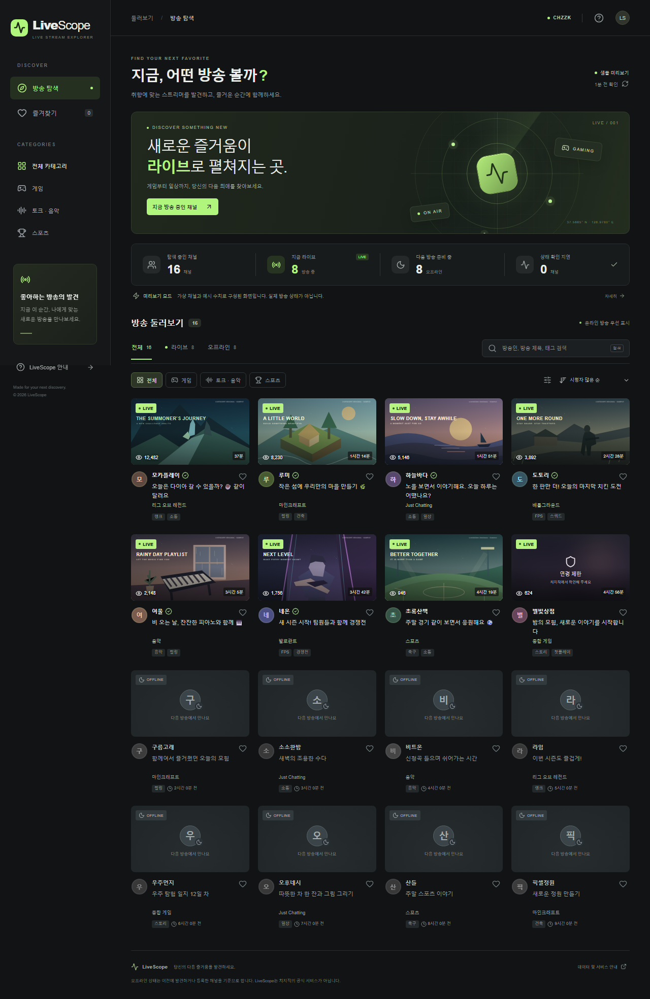

# CHZZK-STREAM-EXPLORER (AI)

**LiveScope — 지금, 어떤 방송 볼까?**

치지직 방송인을 온라인·오프라인 상태, 카테고리, 검색어로 탐색하는 반응형 웹 앱입니다. 전체 라이브 페이지 수집에 성공했을 때만 새로운 상태를 확정합니다.

- [GitHub 저장소](https://github.com/Candy0424/CHZZK-STREAM-EXPLORER-AI)
- [원본 기획서와 누적 개발 일지](CHZZK_STREAM_EXPLORER_PLAN.md)
- [구조와 API](docs/ARCHITECTURE.md) · [운영·배포](docs/OPERATIONS.md) · [검증 기록](docs/VALIDATION.md)

GitHub 이름에는 공백과 괄호를 사용할 수 없어 저장소 식별자는 `CHZZK-STREAM-EXPLORER-AI`입니다.



[360px 모바일 실행 화면](docs/screenshots/mobile.png)

## 현재 제공 범위

| 항목                                                                  | 상태                  |
| --------------------------------------------------------------------- | --------------------- |
| 반응형 탐색 화면, 검색, 상태·카테고리·태그 필터, 정렬, 페이지네이션   | 구현                  |
| 즐겨찾기 100개까지 브라우저에 저장                                    | 구현                  |
| 온라인 외부 링크, 오프라인 비활성화, 이미지 실패 대체, 연령 제한 블러 | 구현                  |
| 치지직 공식 API 클라이언트, 전체 순회, 재시도, 429 쿨다운             | 구현                  |
| PostgreSQL/Drizzle 스키마, 트랜잭션, 분산 실행 잠금, 이력 보존        | 구현                  |
| 공개 조회 API, 인증된 동기화 API, 관리 CLI, GitHub Actions            | 구현                  |
| 실제 공식 API 인증·수집, 운영 PostgreSQL 연결                         | 사용자 환경 설정 필요 |
| 공개 서비스 배포, 시간대별 3회 실사용, 블로그 게시                    | 미실시                |

**기본 실행은 미리보기 모드입니다.** 표시된 이름, ID, 시청자 수, 시각은 모두 가상 예시입니다. 가상 카드 클릭 시 안내가 열리고, 실제 모드의 온라인 카드는 정확한 치지직 채널을 새 탭에서 엽니다. 샘플 데이터는 실제 DB에 시드하지 않습니다.

## 빠른 실행

Node.js **22.12 이상**(24 권장), npm, Git이 필요합니다. Next.js 최신 버전은 이 PC의 기존 Node 20.15보다 높은 버전을 요구합니다.

```bash
git clone https://github.com/Candy0424/CHZZK-STREAM-EXPLORER-AI.git
cd CHZZK-STREAM-EXPLORER-AI
npm ci
npm run dev
```

[http://localhost:3000](http://localhost:3000)을 엽니다. 외부 키나 DB 없이 샘플 화면을 확인할 수 있습니다.

Windows의 `C#` 경로에서는 Vite의 URL 해석 문제를 피하기 위해 `npm test`가 동일 소스를 임시 디렉터리에 복사하여 실행하고 정리합니다. 원래 프로젝트 경로는 그대로 유지합니다. `npm run test:watch`는 `#` 없는 경로에서 사용하세요.

## 실제 방송 연결

1. [치지직 개발자 센터](https://developers.chzzk.naver.com/)에서 독립적인 이름 `LiveScope`로 애플리케이션을 등록하고 라이브 목록·채널 조회 Client 인증 정보를 준비합니다.
2. `.env.example`을 `.env.local`로 복사합니다. 아래 값은 **로컬 파일 또는 호스팅의 비밀 환경 변수에만** 설정합니다.

```dotenv
DEMO_MODE=false
CHZZK_CLIENT_ID=
CHZZK_CLIENT_SECRET=
DATABASE_URL=
CRON_SECRET=
SYNC_INTERVAL_MINUTES=5
SYNC_MAX_PAGES=1000
```

`CRON_SECRET`은 충분히 긴 임의 값(32자 이상)을 사용합니다. DB는 PostgreSQL 연결 URL을 사용하며 운영에서는 공급자가 안내하는 TLS 설정을 적용합니다. 실환경 설정이 실패해도 샘플 데이터로 몰래 대체하지 않습니다.

3. PostgreSQL을 준비합니다. Docker가 설치되어 있다면 로컬 `POSTGRES_PASSWORD`를 설정한 다음 `docker compose up -d`로 시작할 수 있습니다. 비밀번호는 Git에 기록하지 않습니다.
4. 스키마를 적용한 뒤 처음으로 동기화합니다.

```bash
npm run db:migrate
npm run channels -- seed
npm run sync
npm run dev
```

초기 시드는 비어 있습니다. 공식 라이브 목록에서 발견한 채널은 자동으로 등록됩니다. 사전 등록은 [시드 안내](data/README.md)를 참고하세요. 성공적인 빈 라이브 목록은 관리 카탈로그 전체를 오프라인으로 전환합니다.

## 사용법

- **방송 탐색**: 기본적으로 온라인 방송이 먼저 나옵니다. `라이브`·`오프라인` 탭이나 집계 패널을 클릭해 상태를 선택합니다.
- **검색·필터**: 이름, 제목, 카테고리, 태그 검색을 지원합니다. 슬라이더 아이콘에서 세부 카테고리와 정확히 일치하는 태그를 지정합니다.
- **정렬**: 시청자 수, 최근 방송 시작, 이름 순으로 정렬합니다. 온라인 우선은 유지됩니다.
- **즐겨찾기**: 카드의 하트를 누릅니다. 계정 없이 현재 브라우저에 저장됩니다.
- **방송 보기**: 실제 온라인 카드는 공식 채널을 새 탭에서 엽니다. 오프라인 카드에는 이동 링크가 없습니다. 연령 제한 썸네일은 항상 블러 처리되며 공식 사이트에서 확인합니다.
- **새로고침**: 저장된 서버 목록을 다시 조회합니다. 사용자 새로고침으로 치지직 API를 호출하지 않습니다. 브라우저는 1분마다 저장된 목록을 다시 확인합니다.

## 온라인·오프라인과 지연

오프라인은 **이전에 발견하거나 직접 등록한 카탈로그 채널 중 최신 전체 라이브 동기화에 없는 채널**입니다. 치지직의 모든 오프라인 계정을 제공하지 않습니다.

모든 페이지가 성공하면 하나의 DB 트랜잭션으로 상태·현재 라이브·방송 이력·성공 기록을 확정합니다. 일부 페이지 실패, 커서 반복, 페이지 상한 초과, 저장 실패 시 기존 정상 스냅샷을 유지합니다. 실패한 동기화 이후에는 즉시 지연을 안내합니다. 마지막 성공 후 5분 초과는 지연 가능성, 15분 초과는 상태 확인 지연입니다.

전체·온라인·오프라인 집계는 카탈로그 전체 기준입니다. 상태 확인 지연 수는 온라인·오프라인 수와 겹칠 수 있습니다. 목록 제목의 수는 현재 필터 결과입니다.

## 관리 명령

```bash
npm run channels -- add <channelId>
npm run channels -- hide <channelId>
npm run channels -- show <channelId>
npm run channels -- refresh
npm run channels -- review
npm run channels -- logs
npm run sync
```

채널 조회에서 누락된 ID는 `needs_review`로 기록하며 즉시 삭제하지 않습니다. 숨김 채널은 다음 동기화로 다시 공개되지 않습니다. CLI 동기화는 조회 캐시가 만료되는 최대 30초 뒤 화면에 반영됩니다.

## 검증

```bash
npm run typecheck
npm run lint
npm test
npm run build
npx playwright install chromium
npm run test:e2e
```

단위 테스트는 공식 응답을 모킹합니다. DB 통합 테스트는 PGlite의 PostgreSQL 엔진에 실제 Drizzle 마이그레이션을 적용해 트랜잭션 커밋·롤백을 확인합니다. 운영 PostgreSQL의 다중 프로세스 세션 잠금과 실제 치지직 API/Quota 검증을 대체하지는 않습니다.

## 운영·배포

Next.js Node 런타임을 지원하는 호스팅과 관리형 PostgreSQL에 배포할 수 있습니다. `npm run build` 후 `npm start`로 운영합니다. 순수 정적 GitHub Pages로는 서버 API와 DB 동기화를 실행할 수 없습니다.

기본 예약 작업은 `.github/workflows/sync.yml`입니다. GitHub 저장소 Secrets에 4개 비밀 환경 변수를 등록하고 Variables의 `LIVESCOPE_SYNC_ENABLED=true`를 설정하면 5분 간격 워크플로가 활성화됩니다. GitHub Actions는 실행 시각을 보장하지 않으므로 정확한 간격이 필요하면 호스팅 Cron을 사용합니다. 상세 설정과 운영 점검은 [OPERATIONS.md](docs/OPERATIONS.md)에 있습니다.

## 문제 해결

| 증상                   | 확인할 사항                                                       |
| ---------------------- | ----------------------------------------------------------------- |
| `401`                  | Client ID/Secret과 애플리케이션 상태, `.env.local` 로딩           |
| `403`                  | 개발자 센터의 API 사용 권한                                       |
| `429`                  | 다음 주기까지 기다리고 동기화 간격/전체 페이지 수 조정            |
| `500`·연결 실패        | 최대 2회 재시도 후 기존 스냅샷 유지; 동기화 로그 확인             |
| 이미지 누락            | 원본 HTTPS URL 확인; 실패하면 기본 그림으로 대체                  |
| 방송 종료 미반영       | 마지막 COMPLETE 동기화와 30초 서버 캐시 확인                      |
| 온라인 채널이 오프라인 | 전체 커서 순회 성공 여부, 실제 상태 변화 시각, 관리 카탈로그 확인 |
| 예약 작업 미실행       | 활성화 변수, Secrets, Actions 로그, 기본 브랜치 확인              |
| DB 스키마 불일치       | 연결 대상 확인 후 `npm run db:migrate`                            |
| Node 버전 오류         | Node 22.12 이상 또는 24 사용                                      |

## 출처, 한계와 후속 작업

실제 방송 정보는 [치지직 공식 라이브 API](https://chzzk.gitbook.io/chzzk/chzzk-api/live), 프로필은 [채널 API](https://chzzk.gitbook.io/chzzk/chzzk-api/channel)를 사용합니다. [Client 인증 규격](https://chzzk.gitbook.io/chzzk/chzzk-api/tips)을 2026-09-14에 확인했습니다. LiveScope는 치지직의 공식 서비스가 아닙니다.

샘플 썸네일 8개는 이 프로젝트에서 직접 만든 SVG 일러스트입니다. 실존 방송의 캡처나 공식 게임 이미지를 사용하지 않습니다. 아이콘은 Lucide(ISC), 애플리케이션 소스는 [MIT](LICENSE)입니다. 외부 API 데이터의 권리는 해당 권리자에게 있습니다.

실제 라이브 목록은 페이지를 읽는 동안 변할 수 있으므로 완전 순회도 한 시점의 절대적 스냅샷을 보장하지 않습니다. 운영 전 API 호출량과 상태 반영 시간을 측정해야 합니다. 예약 작업이 시작된 채 프로세스가 중단되면 잠금은 DB 연결 종료 때 해제되고, 다음 동기화가 이전 RUNNING 기록을 정리합니다. 서버 캐시는 인스턴스별 최대 30초 차이가 있습니다.

- 공개 서비스 URL: 아직 배포하지 않음
- 실제 시간대별 사용 후기: [기록 양식](docs/USAGE_REVIEW.md), 아직 미실시
- 블로그/SNS: [게시 초안](docs/BLOG_DRAFT.md), 아직 미게시
- 후속 기능: 방송 시작 알림, 로그인·기기 간 동기화, 관리자 UI, PWA
