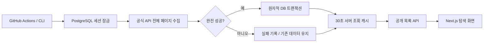

# 구조와 API

`src/lib/chzzk-client.ts`는 Client 인증, 15초 요청 타임아웃, 최대 2회 백오프 재시도, 페이지·채널 응답 Zod 검증을 담당합니다. 429는 재시도하지 않고 최소 5분 및 Retry-After까지 재실행을 억제합니다. 같은 커서 반복, 최대 페이지 수 초과, 응답 필드 손실은 모두 전체 실행 실패입니다.

`sync-lives.ts`는 페이지를 임시 Map에 모읍니다. 중복 채널은 처음 본 데이터를 보존합니다. 전 페이지 수집 완료 전에는 상태를 쓰지 않습니다. `sync-repository.ts`는 세션 단위 advisory lock으로 여러 서버/CLI 실행을 직렬화하고, 단일 트랜잭션으로 카탈로그·현재 라이브·이력을 확정합니다. 100행 단위 배치로 SQL 매개변수 수를 제한합니다. API 요청은 DB 상태 갱신 트랜잭션 밖에서 실행됩니다.

## 데이터 모델

- `channels`: 프로필, 공개 여부, 상태, 최초 발견/최근 라이브/확인 시각, 메타데이터 확인 필요 여부
- `current_lives`: 현재 온라인 채널의 라이브와 완료 동기화 참조
- `live_history`: 방송별 마지막 제목·카테고리·시작/확인 시각. 종료 후에도 보존
- `sync_runs`: 실행 상태, 페이지/라이브/신규 채널 수, 안전한 오류 요약, 재시도 가능 시각

조회 시 repeatable-read 트랜잭션으로 성공 기록과 채널 목록을 같은 DB 스냅샷에서 읽습니다. 숨김 채널은 항상 제외됩니다. 초기 UNKNOWN과 API 누락을 나타내는 `needs_review`는 독립적입니다. 채널 메타데이터 조회 실패가 라이브 상태를 변경하지 않습니다.

## 공개 목록

`GET /api/streamers`

| 매개변수        | 값                                            | 기본값       |
| --------------- | --------------------------------------------- | ------------ |
| status          | all, online, offline, unknown, delayed        | all          |
| query           | 최대 100자, 이름·제목·카테고리·태그 부분 검색 | 빈 값        |
| category        | all, GAME, SPORTS, ETC                        | all          |
| categoryId      | 세부 카테고리 식별자                          | 빈 값        |
| tag             | 태그와 정확히 일치(대소문자 무시), 최대 50자  | 빈 값        |
| sort            | viewers_desc, started_desc, name_asc          | viewers_desc |
| page / pageSize | 1 이상 / 1~60                                 | 1 / 24       |
| ids             | 즐겨찾기 채널 ID, 쉼표 구분; 빈 값은 빈 결과  | 생략 시 전체 |

응답: `items`, 필터 결과 `total`, 카탈로그 `counts`, `categories`, `lastSuccessfulSync`, `freshness`, `mode`, `page`, `pageSize`, `nextPage`, `totalViewers`. 유효하지 않은 쿼리 400, 저장소 조회 실패 503. HTTP는 no-store, DB 스냅샷은 서버 프로세스 메모리에 30초 캐시합니다. 브라우저가 원본 치지직 API를 호출하지 않습니다.

5천 개 이상의 실제 카탈로그는 4 MB를 넘어 Next.js Data Cache의 항목당 2 MB 제한에 걸립니다. `snapshot-cache.ts`는 전체 스냅샷 하나를 메모리에 유지하고 동시 요청의 DB 읽기를 공유합니다. TTL 만료 시 새 조회를 기다리며 실패를 캐시하지 않습니다. 동기화 API는 같은 프로세스의 캐시를 무효화하고, CLI/다른 인스턴스의 변경은 30초 TTL 뒤 반영됩니다. 무효화 전에 시작한 조회가 최신 캐시를 덮어쓰지 않도록 세대를 확인합니다.

실제 API는 미지정 카테고리를 null로, 신규 카테고리를 `ENTERTAINMENT` 등으로 반환합니다. ID와 이름을 보존하면서 미지정·신규 종류는 앱의 기타 필터로 분류합니다. 누락 필드나 잘못된 자료형은 계속 거부합니다.

## 내부 동기화

`POST /api/internal/sync` + `Authorization: Bearer {CRON_SECRET}`

비밀값은 timing-safe 비교합니다. 성공 200, 인증 실패 401, 중복 실행·샘플 모드 409, 쿨다운 429, 전체 동기화 실패 502, 초기 설정/DB 오류 503입니다. 응답에 인증키·연결 문자열·원본 예외를 포함하지 않습니다. 완료 후 조회 캐시를 무효화합니다. 호스팅 실행 제한을 넘는 대규모 순회는 CLI/GitHub Actions에서 실행하세요.

## 링크 이벤트

`POST /api/events`는 같은 origin의 `channel_open`과 유효한 32자리 ID만 허용하며 512자/바이트 상한을 적용합니다. 사용자 식별자/IP를 애플리케이션 로그에 추가하지 않습니다. 클릭 시도만 기록하며 외부 사이트의 실제 로드 성공은 동일 출처 정책상 관찰할 수 없습니다. 연령 제한 정보는 API의 adult 값만 따릅니다.

## 보안 경계

`getDb`, Client 인증, 환경 변수 모듈은 서버 경로와 로컬 CLI에서만 사용됩니다. 프론트엔드 모듈에는 비밀값을 전달하지 않습니다. `.env*`와 빌드 산출물은 Git에서 제외합니다. 외부 링크는 검증된 channelId로만 조립하고 새 탭 + noopener/noreferrer를 적용합니다. 라이브 실패 예외는 정해진 메시지로 축약해 연결 문자열 노출을 피합니다.
